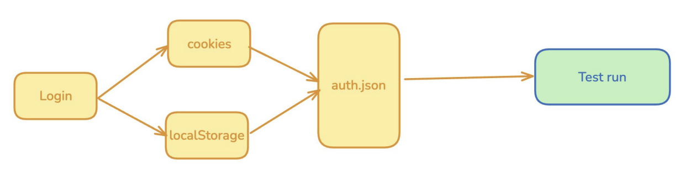
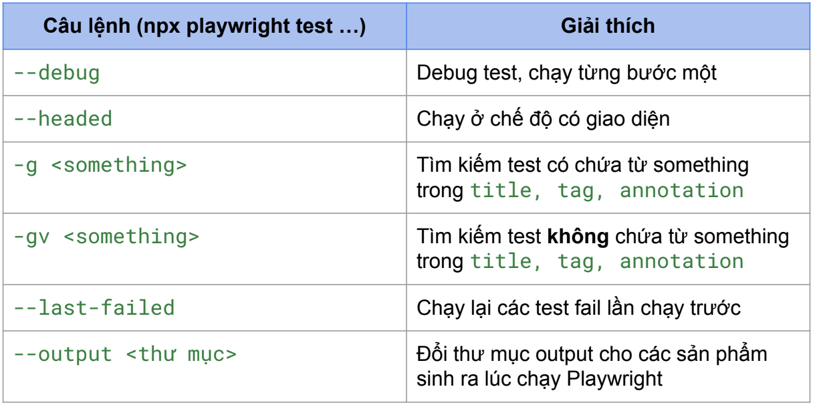
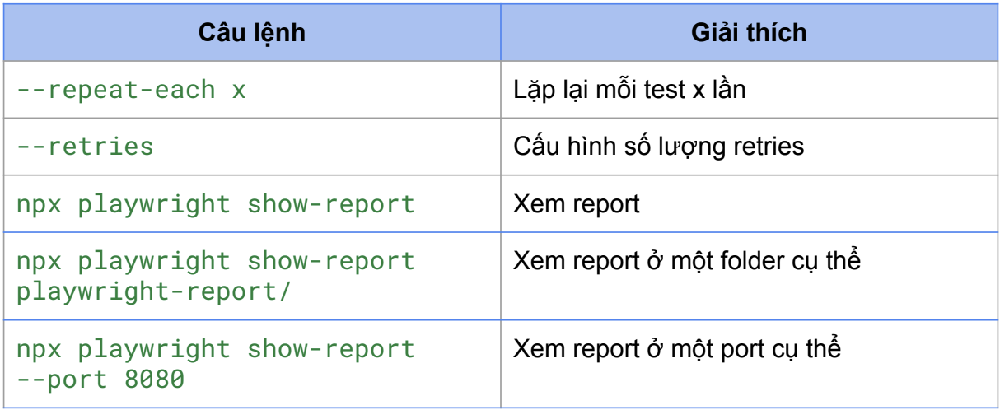
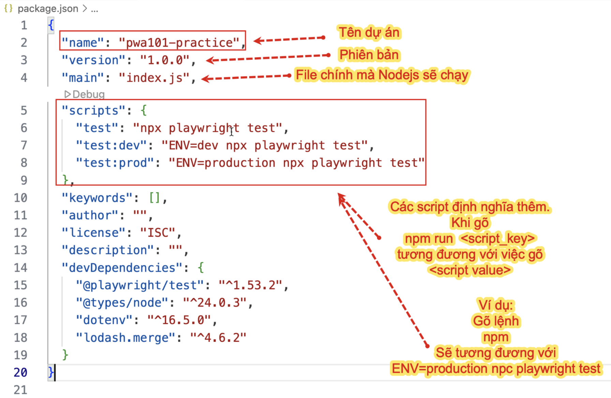

# 1. Network interception (API mocking)
> “chặn” request, “chặn” response
- Network Interception trong Playwright cho phép can thiệp vào các HTTP Request giữa browser và server
- API Mocking là 1 phần quan trọng giúp giả lập các response API mà không cần gọi server thực tế
- Lợi ích:
    - Tăng tốc độ test
    - Cô lập test
    - Test edge cases
    - Dễ debug
- Khi nào dùng:
    - Test API fail
    - Mock data động
    - Test offline mode hoặc caching
- Ví dụ:
Chặn request: chặn tất cả resource image:
```
await page.route('**/*', (route) => {
    return route.request().resourceType() === 'image'
        ? route.abort()
        : route.continue();
});
```
Chặn và sửa response: 
```
await page.route('*/**/api/v1/fruits', async route => {
    const json = [{ name: 'Strawberry', id: 21 }];
    await route.fulfill({ json }); // Trả về front-end mà không gọi backend
});
 
// Thay đổi response của API để UI hiển thị theo ý muốn
await page.route('*/**/api/v1/fruits', async route => {
    if (route.request().url().includes('donotchange')) {
        route.continue();
        return;
    }
    const response = await route.fetch();
    const json = await response.json();
    json.push({ name: 'Nga Quynh', id: 100 });
    json.push({ name: 'Lan Anh', id: 101 });
    await route.fulfill({ response, json });
});
```
 
 
# 2. Global setup & teardown
- Là một test riêng biệt, được chạy trước/sau TẤT CẢ các test
- Khác gì hook, fixtures?
    - Hooks, fixtures: chạy cho mỗi test hoặc mỗi worker
    - Global setup & global teardown: chạy 1 lần duy nhất
- Ứng dụng thực tế - Global setup:
    - Đăng nhập một lần và lưu lại state (cookie, token) để dùng lại trong các test → giúp giảm thời gian và tài nguyên
    - Khởi tạo dữ liệu test ban đầu vào database hoặc API
    - Thiết lập cấu hình chung (ví dụ: tạo file cấu hình, đọc biến môi trường)
    - Khởi động service bên thứ ba (nếu cần), ví dụ mock server, database giả lập, v.v
- Ứng dụng thực tế - Global teardown:
    - Xóa dữ liệu test đã tạo ở bước setup
    - Dừng các service bên thứ ba đã khởi động ở bước setup
    - Dọn dẹp tài nguyên tạm thời (file, kết nối, cache...)
- Ví dụ:
```
import { defineConfig } from '@playwright/test';
export default defineConfig({
    testDir: './tests',
    // ...
    projects: [
        {
            name: 'setup db',
            testMatch: /global\.setup\.ts/,
            testDir: './global-settings',
            teardown: 'cleanup db',
        },
        {
            name: 'cleanup db',
            testMatch: /global\.teardown\.ts/,
            testDir: './global-settings',
        },
        {
            name: 'chromium',
            use: { ...devices['Desktop Chrome'] },
            dependencies: ['setup db'],
        },
    ]
});
```
 
 
# 3. Reuse authentication state
> Sử dụng lại “trạng thái đăng nhập”


- Reuse authentication state là kỹ thuật lưu trạng thái đăng nhập sau khi login lần đầu, rồi tái sử dụng cho các test sau mà không cần đăng nhập lại
- Lợi ích:
    - Tiết kiệm thời gian
    - Tối ưu resource
    - Tăng độ tin cậy
- Ví dụ: 
```
const authFile = "auth.json";

// Test 1: login và lưu trạng thái login vào trong file auth.json
test("Test 1: Login and save state", async ({ }) => {
    await loginPage.navigateToLoginPage();
    await loginPage.login(usernameValid, passwordValid);
    await loginPage.page.context().storageState({ path: authFile });
});

// Sử dụng authentication state trước khi chạy test khác
test.use({
    storageState: authFile
});

// Test 2: sử dụng lại file storageState đã lưu sẵn trạng thái đăng nhập
test("Test 2: Reuse authentication state", async ({ }) => {
    await homePage.navigateToProductPage();
});
```
 

# 4. Auto waiting: toPass & poll
> Biến non-auto waiting thành auto waiting
- expect.toPass: Retry block code cho tới khi success:
option: 
    - timeout: thời gian tối đa retry
    - intervals: các lần lặp cách nhau bao lâu
```
await expect(async () => {
    const response = await page.request.get('some_url');
    expect(response.status()).toBe(200);
    }).toPass({
        timeout: 10_000,
        intervals: [1000, 2000, 5000]
});
```
- expect.poll: Chỉ retry giá trị trả về, phù hợp khi cần poll một giá trị cụ thể:
```
await expect.poll(async () => {
    const response = await page.request.get('https://api.example.com');
    return response.status();
    }, {
    // Custom expect message for reporting, optional.
    message: 'make sure API eventually succeeds',
    // Poll for 10 seconds; defaults to 5 seconds. Pass 0 to disable timeout.
    timeout: 10000,
}).toBe(200);
```

 
# 5. Run test by command line
- Xem tất cả lệnh: npx playwright --help
- Lệnh chạy test: npx playwright test [options] [test-filter...]
(trong đó: [options]: các tuỳ chọn, [filters]: điều kiện lọc tests)
- 1 số lệnh thường dùng:




# 6. UI mode: tìm hiểu về UI mode
> Giúp chạy test, debug test, filter test, xem time travel
- Lợi ích:
    - Dễ sử dụng
    - Debug hiệu quả
    - Tối ưu phát triển
    - Filter linh hoạt
- Lệnh: npx playwright test --ui


# 7. Kiến thức bổ sung
## 7.1 API context
Có thể tạo API context thông qua 2 cách:
- Sử dụng request import trực tiếp từ @playwright/test
Ví dụ:
```
import { test, request } from "@playwright/test";

test.describe("Create request context - through request", async () => {
    let adminRequestContext: any;

    test.beforeEach(async () => {
        adminRequestContext = await request.newContext({
            baseURL: "https://example.com/wp-json/wc/v3/",
            extraHTTPHeaders: {
                "Content-type": "application/json",
                "Authorization": `Basic ${process.env.WORDPRESS_TOKEN}`
            }
        })
    })

    test("Test create product with context", async () => {
        const response = await adminRequestContext.post('products', {
            data: JSON.stringify({
                "name": "PW102 - product 01",
                "type": "simple",
                "regular_price": "12",
                "description": "Medical product",
                "short_description": "Medical product"
            })
        })
        console.log(response.status());
    })
})
```
- Sử dụng fixture playwright:
Ví dụ:
```
import { test } from "@playwright/test";

test.describe("Create request context - through request", async () => {
    let adminRequestContext: any;

    test.beforeEach(async ({ playwright }) => {
        adminRequestContext = await playwright.request.newContext({
            baseURL: "https://example.com/wp-json/wc/v3/",
            extraHTTPHeaders: {
                "Content-type": "application/json",
                "Authorization": `Basic ${process.env.WORDPRESS_TOKEN}`
            }
        })
    })

    test("Test create product with context", async () => {
        const response = await adminRequestContext.post('products', {
            data: JSON.stringify({
                "name": "PW102 - product 01",
                "type": "simple",
                "regular_price": "12",
                "description": "Medical product",
                "short_description": "Medical product"
            })
        })
        console.log(response.status());
    })
})
```

## 7.2. Woocommerce API
- Website e-commerce.betterbytesvn.com sử dụng Woocommerce - một platform rất nổi tiếng để tạo các website bán hàng.
- Woocommerce cung cấp các API để có thể tương tác với sản phẩm: thêm, sửa, xóa,...
https://woocommerce.github.io/woocommerce-rest-api-docs/#create-a-product

## 7.3 File package.json
- File package.json là một thành phần cốt lõi trong bất kỳ dự án Playwright nào. Nó chứa thông tin mô tả dự án, cấu hình, script, và quan trọng nhất là các dependencies (thư viện mà dự án phụ thuộc)

- Phần scripts sẽ giúp ta định nghĩa các câu lệnh thường dùng một cách ngắn gọn. Ví dụ: với scripts trong hình, thay vì gõ: npx playwright test -> Chỉ cần gõ: npm run test

## 7.4 Test match, test ignore
> Cấu hình trong playwright.config.ts file
- Test match: lọc ra các test "cần chạy" cho project
    - Cú pháp: testMatch: string | RegExp | Array<string | RegExp>
    - Ví dụ: Match các file test có chứa từ login hoặc register:
    ```
    testMatch: [
        '**/login*.spec.{ts,js}',
        '**/register*.spec.{ts,js}',
    ],
    ```
        
- Test ignore: lọc ra các test "không cần chạy" cho project
    - Cú pháp: testIgnore: string | RegExp | Array<string | RegExp>
    - Ví dụ: Ignore các file test có chứa từ login hoặc register:
    ```
    testIgnore: [
        '**/login*.spec.{ts,js}',
        '**/register*.spec.{ts,js}',
    ],
    ```
